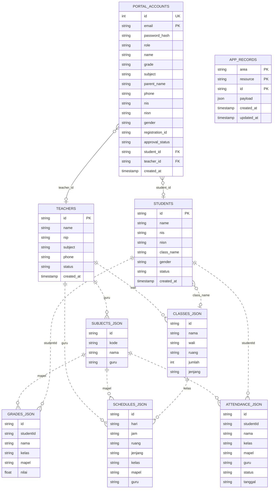

# ERD Sistem Informasi Akademik Maranatha

Diagram ini menampilkan 4 tabel fisik MySQL dan 5 entitas logis berbasis JSON.

```mermaid
erDiagram
    PORTAL_ACCOUNTS }o--o| STUDENTS : student_id
    PORTAL_ACCOUNTS }o--o| TEACHERS : teacher_id

    STUDENTS }o..o| CLASSES_JSON : class_name
    TEACHERS ||..o{ CLASSES_JSON : wali
    TEACHERS ||..o{ SUBJECTS_JSON : guru

    CLASSES_JSON ||..o{ SCHEDULES_JSON : kelas
    SUBJECTS_JSON ||..o{ SCHEDULES_JSON : mapel
    TEACHERS ||..o{ SCHEDULES_JSON : guru

    STUDENTS ||..o{ GRADES_JSON : studentId
    SUBJECTS_JSON ||..o{ GRADES_JSON : mapel

    STUDENTS ||..o{ ATTENDANCE_JSON : studentId
    SUBJECTS_JSON ||..o{ ATTENDANCE_JSON : mapel

    PORTAL_ACCOUNTS {
        int id UK
        string email PK
        string password_hash
        string role
        string name
        string grade
        string subject
        string parent_name
        string phone
        string nis
        string nisn
        string gender
        string registration_id
        string approval_status
        string student_id FK
        string teacher_id FK
        timestamp created_at
    }

    STUDENTS {
        string id PK
        string name
        string nis
        string nisn
        string class_name
        string gender
        string status
        timestamp created_at
    }

    TEACHERS {
        string id PK
        string name
        string nip
        string subject
        string phone
        string status
        timestamp created_at
    }

    APP_RECORDS {
        string area PK
        string resource PK
        string id PK
        json payload
        timestamp created_at
        timestamp updated_at
    }

    CLASSES_JSON {
        string id
        string nama
        string wali
        string ruang
        int jumlah
        string jenjang
    }

    SUBJECTS_JSON {
        string id
        string kode
        string nama
        string guru
    }

    SCHEDULES_JSON {
        string id
        string hari
        string jam
        string ruang
        string jenjang
        string kelas
        string mapel
        string guru
    }

    GRADES_JSON {
        string id
        string studentId
        string nama
        string kelas
        string mapel
        float nilai
    }

    ATTENDANCE_JSON {
        string id
        string studentId
        string nama
        string kelas
        string mapel
        string guru
        string status
        string tanggal
    }
```
